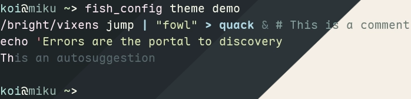
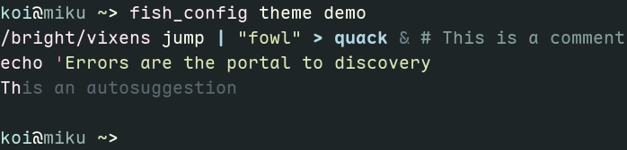
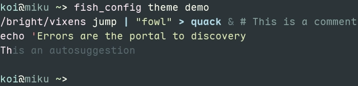
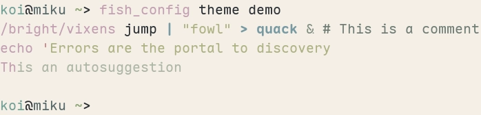

<h3 align="center">
  <br/>
  Evergarden for <a href="https://fishshell.com">Fish</a>
</h3>

<p align="center">
  <a href="https://codeberg.org/evergarden/fish/stars">
    
  </a>
  <a href="https://codeberg.org/evergarden/fish/issues">
    
  </a>
  <a href="https://codeberg.org/evergarden/fish/activity/contributors">
    
  </a>
</p>

<p align="center">
  
</p>

### Previews

<details>
  <summary>Winter</summary>
  
</details>
<details>
  <summary>Fall</summary>
  
</details>
<details>
  <summary>Spring</summary>
  
</details>
<details>
  <summary>Summer</summary>
  
</details>

### Usage

1. Download the variant of your choice from `themes/` to your
   [fish themes directory](https://fishshell.com/docs/current/cmds/fish_config.html#theme-files)
   (usually `~/.config/fish/themes/`)
2. Add the following to your fish config:
   ```fish
   fish_config theme choose evergarden-<variant>
   ```

### Thanks to <3

- [robin](https://codeberg.org/comfysage) for being so awesome and cute <3
- [june](https://codeberg.org/koibtw)

<hr>

<p align="center">
  <a href="https://codeberg.org/evergarden/fish/src/COPYING">
    
  </a>
</p>
